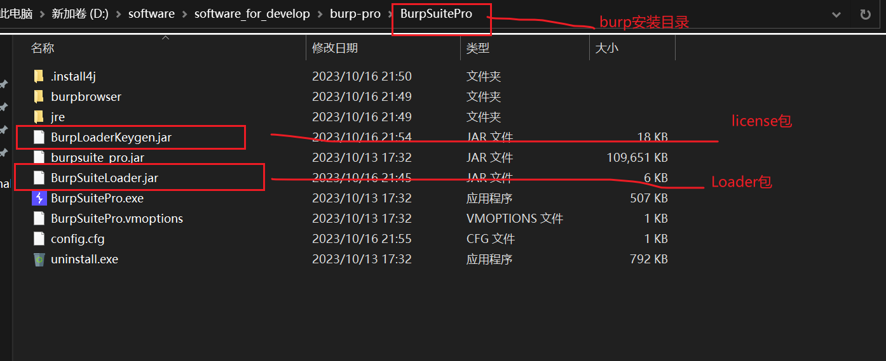

# burpsuite

# 1. 概述

## 1.1 基本介绍

```
Burp Suite 是用于攻击web 应用程序的集成平台。它包含了许多工具，并为这些工具设计了许多接口，以促进加快攻击应用程序的过程。

也就是说，Burp Suite是web应用程序渗透测试集成平台。从应用程序攻击表面的最初映射和分析，到寻找和利用安全漏洞等过程，所有工具为支持整体测试程序而无缝地在一起工作。

平台中所有工具共享同一robust框架，以便统一处理HTTP请求、持久性、认证、上游代理、日志记录、报警和可扩展性。
Burp Suite允许攻击者结合手工和自动技术去枚举、分析、攻击Web应用程序。

Buro Suite是用于攻击web应用程序的集成平台，包含了许多工具。Burp Suite为这些工具设计了许多接口，以加快攻击应用程序的过程。所有工具都共享一个请求，并能处理对应的HTTP消息、持久性、认证．代理，日志，警报。

Burpsuite 是由JAVA语言编写，所以Burpsuite是一款跨平台的软件。
但是在测试过程中 Burpsuite 不像其他自动化测试工具不需要输入任何内容即可完成测试，而需要手动的配置某些参数触发对应的行为才会完成测试。

#版本区别
1.enterprise
2.professional
3.community
最主要的区别在于Web漏洞扫描。
```

## 1.2 常规功能

```
Proxy——是一个拦截HTTP/S的代理服务器，作为一个在浏览器和目标应用程序之间的中间人，允许你拦截，查看，修改在两个方向上的原始数据流。

Spider——是一个应用智能感应的网络爬虫，它能完整的枚举应用程序的内容和功能。

Scanner[仅限专业版]——是一个高级的工具，执行后，它能自动地发现web 应用程序的安全漏洞。

Intruder——是一个定制的高度可配置的工具，对web应用程序进行自动化攻击，如：枚举标识符，收集有用的数据，以及使用fuzzing 技术探测常规漏洞。

Repeater——是一个靠手动操作来补发单独的HTTP 请求，并分析应用程序响应的工具。

Sequencer——是一个用来分析那些不可预知的应用程序会话令牌和重要数据项的随机性的工具。

Decoder——是一个进行手动执行或对应用程序数据者智能解码编码的工具。

Comparer——是一个实用的工具，通常是通过一些相关的请求和响应得到两项数据的一个可视化的“差异”。
```


# 2.使用

## 2.1 下载

```
1.前置工作
burpsuite是基于JDK的, 安装之前, 需要先安装jdk

2.下载(burpsuite community edition)并安装即可
https://portswigger.net/burp/communitydownload

3.虽然网络上有各种破解版, 但建议大家支持正版.
```


### 2.1.1 社区版安装


### 2.1.2 pro 版本安装

> 1.下载软件包

```
https://portswigger.net/burp/releases/professional-community-2023-10-2-2
https://github.com/d3417/BurpSuite-Pro-2021-Cracked/tree/main
https://github.com/x-Ai/BurpSuite
```


> 2.安装 burp-pro版本, 直接点击下一步即可

> 3.将 BurpSuiteLoader.jar 放到burp的安装目录下



> 4.启动 BurpSuiteLoader.jar (burpsuite_pro.jar换成自己安装的burp的安装目录的 jar 包名称)
>
> java -noverify -Dsun.java2d.d3d=false -Dsun.java2d.noddraw=true --add-opens=java.base/jdk.internal.org.objectweb.asm=ALL-UNNAMED --add-opens=java.base/jdk.internal.org.objectweb.asm.tree=ALL-UNNAMED -javaagent:BurpSuiteLoader.jar -jar burpsuite_pro.jar


## 2.2 安装 burp 证书并使用内置浏览器

### 2.2.1 安装 burp 证书

```
1.打开 burp 自带的浏览器
Proxy -->
Intercept -->
Open Browser

2.在浏览器中输入 burp 证书网址：
http://burp

3.点击右上角 CA Cerficate 下载 burp 的 CA证书

4.安装到本机：
点击刚才下载的证书 -->
安装证书 -->
存储位置 选择 “当前用户” -->
将所有的证书都放入下列存储 -->
浏览 -->
受信任的的根证书颁发机构 -->
确定

firefox添加信任该证书
https://blog.csdn.net/xf555er/article/details/127966219 
```


### 2.2.2 使用内置浏览器

```
浏览器配置如下图所示，配置之后，可以该浏览器支持查看源码(如GWT)。
Proxy --> Proxy settings --> Tools --> Burp's browser --> 
勾选 Store browser data
勾选 Allow Burp's browser to run without a sandbox
勾选 Use the GPU

Note:
需要指出的是，该内置浏览器保存书签时可能报错，可以采取的迂回策略是：
将自己安装的chrome的书签同步为firefox的书签，然后再将firefox的书签同步给burp自带的chrome浏览器。
```


## 2.3 Proxy 模块

```
Burp Proxy 是 Burp Suite以用户驱动测试流程功能的核心，通过代理模式，可以让我们拦截、查看、修改所有在客户端和服务端之间传输的数据。

Intercept is on 和 Intercept is off 表示开启或关闭代理截断功能。
Forward 表示将截断的 HTTP 或 HTTPS 请求发送到服务器。
Drop 表示将截断的 HTTP 或 HTTPS 请求丢弃。
Action 表示将代理截断的 HTTP 或 HTTPS 请求发送到其他模块或做其他处理。
对 Intercept 进行 Raw Hex Parawms Header切换查看不同的数据格式。

Options具有的功能:
代理监听设置、截断客户端请求、截断服务器响应、截断webSocket通信、
服务端响应修改（绕过JS验证文件上传)、匹配与替换HTTP消息中的内容、
通过SSL连接web服务器配置、其他配置选项。

Action详解：
**Send to Spider**             发送给爬虫
**Do an active scan**          执行主动扫描
**Send to Intruder**             发送到入侵者
**Send to Repeater**          发送到中继器
**Send to Sequencer**       发送到序列发生器
**Send to Comparer**        发送到比较器
**Send to Decoder**   		发送到解码器
**Request in browser**       在浏览器的请求
**Engagement tools**        参与工具
**Change request method**  对所有的请求，经过把所有相关的请求参数适当地搬迁到这个请求里来，你就可以自动地把请求的方法在 POST 和 GET 中间切换。通过发送恶意的请求使用这个选项来快速测试应用程序的极限参数是多少。
**Change body encoding**   对于所有的请求，你可以在应用程序/X-WWW 格式的 URL 编码和多重表单/数据之间切换消息体的编码方式。
**Copy URL**       把当前的 URL 完整地复制到粘贴板上。
**Cope as curl command**   作为curl命令。
**Cope to file**       这个功能允许你把选择一个文件，并把消息的内容复制到这个文件里。这个对二进制数据来说是很方便的，要是通过粘贴板来复制会带来一些问题。复制操作是在选择的文本上进行的，如果没有被选中的内容，则是针对整个消息了。
**Pase form file**       这个功能允许你选择一个文件，并把文件里的内容粘贴到消息里。这个对二进制数据来说是很方便的，要是通过粘贴板来复制会带来一些问题。粘贴操作会替换掉被选中的内容，如果没有内容被选中，则在光标位置插入这些内容。
**Save item** 这个功能让你指定一个文件，把选中的请求和响应以XML的格式保存到这个文件，这里面包括所有的元数据如：响应的长度，HTTP 的状态码以及 MIME 类型。
**Don't intercept requests**       通过这些命令可以快速地添加拦截动作的规则来阻止拦截到的消息，这些消息和当前的消息有着相同的特征(如远程主机，资源类型，响应编码)。
**Do intercept**          仅对请求有效，这允许你可以对当请求和响应的进行强制拦截。
**Convert seiection**                 这些功能让你能够以多种方案对选择的文本进行快速的编码和解码。
**URL-encode as you type**    如果这个选项被打开，你输入的像&和=这样的符号会被等价的 URL编码代替。
**Cut**                                           剪切
**Copy**                                       复制
**Paste**                                       粘贴
**Message edit help**               消息编辑帮助
**Proxy interception help**       代理拦截帮助
```

### 2.3.1 代理设置


> 这里设置代理是在 49173 端口，如果使用 chrome 浏览器，又不想走系统代理，则可以通过 chrome 的浏览器插件 "Proxy SwitchyOmega" 设置专属代理 "burp_localhost"，并切换代理至 "burp_localhost"，注意保持端口一致。


### 2.3.2 一个小案例

https://www.accessdata.fda.gov/scripts/cder/daf/index.cfm


#### 2.3.2.1 设置 Target - Scope，过滤指定的资源

这里是以设置过滤 host 为例 (www.accessdata.fda.gov), 可以根据实际情况自行设置 include/exclude 规则。


``` 此时刷新一下网页，可以看到只过滤了指定规则对应的资源 ```


#### 2.3.2.2 拦截并修改请求和响应(Request - Response) 

```设置拦截规则```


```开启拦截功能```


```访问符合拦截规则的页面,观察到页面在加载```

https://www.accessdata.fda.gov/scripts/cder/daf/index.cfm?event=browseByLetter.page&productLetter=B&ai=0


```切换到 burp，发现请求已经被拦截，此时修改请求参数，此时将B改为C, 然后点击 'Forward按钮'```


```可以从burp-->Proxy-->HTTP history中看到response是参数为C时的响应结果```


### 2.3.3 开启拦截代理功能

```
#浏览器截断代理功能默认是关闭的
Proxy --> Intercept --> Intercept is off

#1.打开浏览器截断代理功能
Proxy --> Intercept --> Intercept is on

#2.输入一个网址：
https://fda.gov

#3.
```

### 2.3.4 Burp 截断响应剔除 Javascript 脚本(绕过js验证)

```
#1.概述
JavaScript一种直译式脚本语言，是一种动态类型、弱类型、基于原型的语言，内置支持类型。
它的解释器被称为JavaScript引擎，为浏览器的一部分，广泛用于客户端的脚本语言，
最早是在HTML(标准通用标记语言下的一个应用)网页上使用，用来给HTML网页增加动态功能。
例如:对于上传文件进行JS验证。

#2.Burp 设置截断响应剔除 Javascript 脚本
Proxy --> Intercept --> 
Response Modification --> 
Remove all JavaScript
```


## 2.4 Target 模块

### 2.4.1 概述

```
Burp Target组件主要包含
站点地图、目标域、Target 工具三部分组成，
他们帮助渗透测试人员更好地了解目标应用的整体状况、当前的工作涉及哪些目标域、
分析可能存在的攻击面等信息
```


### 2.4.2 Target Scope

```
Target Scope中作用域的定义比较宽泛，
通常来说，当我们对某个产品进行渗透测试时，
可以通过域名或者主机名去限制拦截内容，这里域名或主机名就是我们说的作用域;
如果我们想限制得更为细粒度化，比如，
你只想拦截login目录下的所有请求，这时我们也可以在此设置，此时，作用域就是目录。

Scope -->
Use advanced scope control -->
设置 include in scope / exclude in scope
Add -->
设置 Protocol,Host or IP range,Port,File等
```


### 2.4.3 Site map

```
Site Map的左边为访问的URL，按照网站的层级和深度，
树形展示整个应用系统的结构和关联其他域的url情况;
右边显示的是某一个url被访问的明细列表，共访问哪些url，请求和应答内容分别是什么，都有着详实的记录。
基于左边的树形结构，我们可以选择某个分支，对指定的路径进行扫描和抓取。

对于同一Web系统，不登录与登录系统是具有不同的响应的。
针对这样的情况可以使用Burpsuite中Sitemap比较两者的区别。
```


## 2.5 Intruder 模块

### 2.5.1 概述

```
在渗透测试过程中，我们经常使用Burp Intruder，它的工作原理是: 
Intruder在原始请求数据的基础上，通过修改各种请求参数，以获取不同的请求应答。
每一次请求中，Intruder通常会携带一个或多个有效攻击载荷（Payload),
在不同的位置进行攻击重放，通过应答数据的比对分析来获得需要的特征数据。
```


#### 2.5.1.1 Positions -> Attack Type

```
Sniper 单参数爆破，多参数时同一个字典按顺序替换各参数，总之初始值有一个参数不变
Battering ram 多参数同时爆破，但用的是同一个字典
Pichfork 多参数同时爆破，但用的是不同的字典
Cluster bamb 多参数做笛卡尔乘积模式爆破
```


> Sniper（狙击手模式）

```
添加了一个参数，且假设payload有500个，那么就会执行500次。

添加了两个参数，就会挨着来，第一个参数开始爆破时，第二个不变，如此这样，会进行500+500此 总共1000次爆破。
```

> ### **Battering ram（攻城锤模式）**

```
单参数情况下，与Sniper一样。

两个参数时，和sniper模式不同的地方在于，同样情况下，攻击次数减半，每次两个位置用同样的字典。
```


> ### **Pitchfork（草叉模式）**

```
可以多组密码本payload，又与battering ram相同的地方在于，一一对应。

dict1：1，2
dict2：3，4
第一次爆破为1，3，第二次爆破为2，4

如果两个payload行数不一致的话，取最小值进行测试。
```


> ### **Cluster bomb（集束炸弹模式）**

```
集束炸弹模式跟草叉模式不同的地方在于，集束炸弹模式会对payload组进行笛卡尔积。
多个密码本对应多个位置，交叉组合，每一个密码本里的密码都对应于另一密码本所有密码。

即dict1的第N个密码和dict2的每个密码进行组合爆破。(排列组合的问题)
```


#### 2.5.1.2 Positions -> Payload positions

```
第一步，先由其他模块 send to intruder 至此或者直接在此处手动填写即可。
第二步，Add $ 等等。

你可以使用选项上的按钮来控制位置上的标记：
1. add § — 在当前光标位置插入一个位置标记。
2. clear § — 删除整个模板或选中的部分模板里的位置标记。
3. auto § — 这会对放置标记的位置做一个猜测，放哪里会有用，然后就把标记放到相应位置。这是一个为攻击常规漏洞(SQL 注入)快速标记出合适位置的有用的功能，然后人工标记是为自定义攻击的。
4.refresh — 如果需要，可以刷新编辑器里有颜色的代码。
5.clear — 删除整个编辑器内容。
```


### 2.5.2 使用场景

```
1、标识符枚举Web应用程序经常使用标识符来引用用户、账户、资产等数据信息。
2、提取有用的数据在某些场景下，而不是简单地识别有效标识符，你需要通过简单标识符提取一些其他的数据。
3、模糊测试很多输入型的漏洞，如SQL注入，跨站点脚本和文件路径遍历可以通过请求参数提交各种测试字符串，
并分析错误消息和其他异常情况，来对应用程序进行检测。
由于应用程序的大小和复杂性，手动执行这个测试是一个耗时且繁琐的过程。
这样的场景，您可以设置Payload，通过Burp Intruder自动化地对Web应用程序进行模糊测试。
```

### 2.5.3 使用步骤

```
1.设置代理，开启burp截断需要测试的HTTP请求
2.将截断的HTTP请求右键发送到Intruder模块，设置payload进行测试
3.筛选Intruder结果，选取有用的信息
```


## 2.6 Repeater

### 2.6.1 概述

```
手动操作来触发单独的HTTP请求，并进行应用程序响应的工具。
此功能用于根据不同的情况修改和发送相同的请求并分析，通过调整Request的参数，不断尝试，通过Response查看状态。从而节省在浏览器中操作的时间。 

(1):Burp Repeater是一个手动修改、补发个别HTTP请求，并分析它们的响应的工具。它最大的用途就是能和其他Burp Suit工具结合起来使用。可以将目标站点地图、Burp Proxy浏览记录、Burp Instruder的攻击结果，发送到Repater上，并手动调整这个请求来对漏洞的探测或攻击进行微调。
(2):在渗透测试过程中，我们经常使用Repeater进行请求与响应的消息验证分析，修改请求参数、验证输入的漏洞；修改请求参数、验证逻辑越权；从拦截历史记录中捕获特征性的请求消息进行重放。
(3):在Repeater的操作界面中，左边的Request为请求消息区，右边的Request为应答消息区，请求消息区显示的是客户端发送的请求消息的详细信息。当编辑完请求消息后，单击"GO"按钮即可发送请求给服务器。
(4):应答消息区显示的是对对应的请求消息单击"GO"按钮后，服务器端的反馈消息，通过修改请求消息的参数来比对分析每次应答消息之间的差异，能更好的帮助我们分析系统可能存在的漏洞。
```


### 2.6.2 使用场景


### 2.6.3 使用步骤


## 2.7 Sequencer


## 2.8 Decoder

```
Burp Decoder的功能比较简单，作为Burp Suite中一款编码解码工具，它能对原始数据进行各种编码格式和散列的转换。
其界面如下图，主要由输入域、输出域、编码解码选项三大部分组成。

输入域
即输入需要解码的原始数据，此处可以直接填写或粘贴，也可以通过其他Burp工具的上下文菜单中【Send to Decoder】。

输出域
即对输入域进行解码的结果显示出来。
无论是输入域还是输出域都支持文本与Hex两种格式。

编码解码选项中，由解码选项（Decode as)、编码选项（Encode as)、散列（Hash）三个构成。
实际使用中，可以根据场景的需要进行设置。
对于编码解码选项，目前支持URL、HTML、Base64、ASCII、16进制、8进制、2 进制、GZIP共八种形式的格式转换，Hash散列支持SHA、SHA-224、SHA-256、SHA-384、SHA-512、MD2、MD5格式的转换，更重要的是，对于同一个数据，我们可以在Decoder的界面，进行多次编码解码的转换。
```


## 2.9 过滤

### 2.9.1 过滤指定域名

```
第一步
target->scope
->勾选：use advanced scope control
->include in scope: --> add --> host or ip range: patent.com.cn
->ok

第二步
proxy->options
->Intercept Client Requests
->勾选Intercept requests based on the following rules
->勾选Is in target scope
```


## 2.99 导入导出项目配置/用户配置

```
有时候我们对工程做了很多配置，希望下次进入时直接导入已有配置或者分享给其他人使用，
此时可以先导出配置，然后启动burp的时候导入配置即可。
```


### 2.99.1 导出配置


### 2.99.2 导入配置


## 2.100 Extension

### 2.100.1 使用官方库里的扩展


### 2.100.2 自定义 extension


# 3. 手机端抓包

## 3.1 基本流程

```
目前webApp(手机App)的通信任然使用HTTP协议进行对应的通信。
可以通过Burp设置代理，然后手机设置网络代理，通过Burp截断手机APP流量。

1.确保bp所在电脑和你的收集在同一局域网中(如同一个wifi下)
2.bp设置：-->proxy-->options->add->port(8090) & special address(选本机Ip,10.102.225.116)
3.手机设置：设置-->wifi-->详细信息-->设置-->代理-->手动-->主机名(10.102.225.116)-->端口(8090)
4.下载证书并导入手机：
bp-->proxy-->options->Import/export CA certificate
-->export-->certificate in DER format
-->next-->select file(输入一个文件名称，如D:\1111_doc\burpsuite_project\my_bp) 
-->保存-->next--close.
然后在D:\1111_doc\burpsuite_project\my_bp就能看到my_bp文件了。
然后发送给手机，并安装即可。
```


# 99.常见问题

## 99.1 解决burp证书过期问题

[Burp Suite未连接：有潜在的安全问题 PortSwigger CA 造成_你们这样一点都不可耐的博客-CSDN博客_未连接有潜在的安全问题](https://blog.csdn.net/vanarrow/article/details/107855269)

```
1.导出burp证书
proxy->options->Import/export CA certificate
->export->certificate in DER format
->next->D:\1111_doc\burpsuite_project\cacert.der
->next->close

2.firefox导入burp证书
设置->隐私与安全->证书->查看证书->导入
->D:\1111_doc\burpsuite_project\cacert.der
->勾选：信任由此证书颁发机构来标识网站
->确定

3.配置firefox代理的端口号
设置->搜索"proxy"->网络设置->设置->手动配置代理
->HTTP代理 127.0.0.1，端口：8099
->勾选：也将代理用于HTTPS
->确定

4.配置burp代理
proxy->options->Add
->port: 8099
->loopback only
->ok
```


## 99.2 burp中文乱码问题

```
user options->Display
->HTTP Message Display
->Change font
->font 选择“黑体”
->ok
```


## 99.3 链接不安全

https://blog.csdn.net/qq_30817059/article/details/130036828

```
方案1：
>> 在burp自带的浏览器输入： 
chrome://flags/
>> 搜索 Allow invalid certificates for resources loaded from localhost.
然后将其设置为 Enabled
>> 重启浏览器
```


# 999.参考资料

https://cloud.tencent.com/developer/article/1999030

https://zhuanlan.zhihu.com/p/640885449

https://blog.csdn.net/weixin_54787369/article/details/122925565 (设置拦截并修改request和response)

[burpsuite十大模块详细功能介绍【2021版】 - 腾讯云开发者社区-腾讯云](https://cloud.tencent.com/developer/article/1999030)

